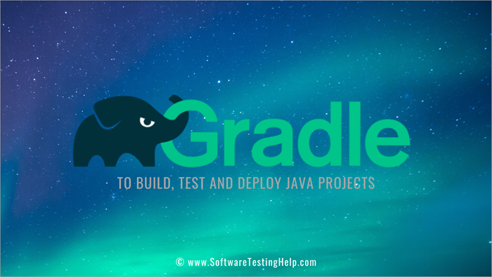
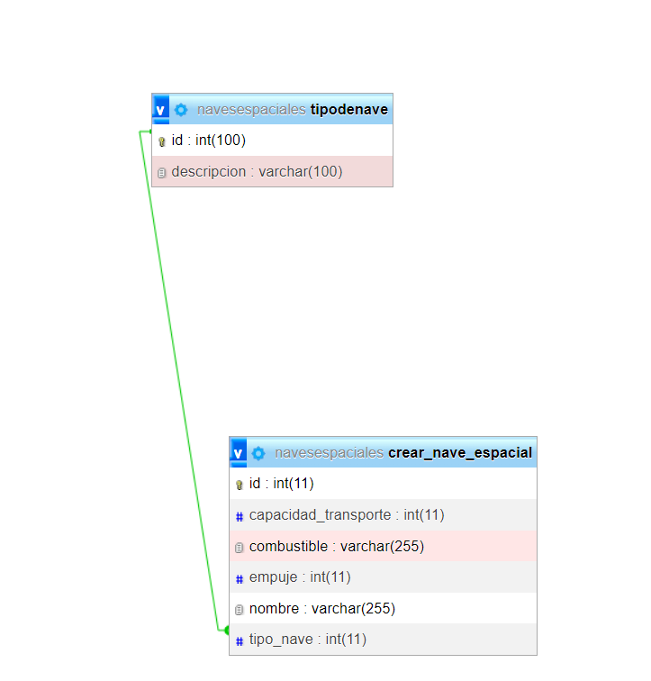

# 

# API de naves espaciales 

## Framework
# 

* Spring boot: Es un framework desarrollado para el trabajo con Java como lenguaje de programación. Se trata de un entorno de desarrollo de código abierto y gratuito. 

# 

* MySQL permite almacenar y acceder a los datos a través de múltiples motores de almacenamiento, incluyendo InnoDB, CSV y NDB. MySQL también es capaz de replicar datos y particionar tablas para mejorar el rendimiento y la durabilidad.

## Herramientas de compilación 

# 

### Gradle

* Es un gestor de proyectos.

## La estructura completa del proyecto es la siguiente:

* Controller: Son el punto de destino final al que puede llegar una solicitud web. Después de ser invocado, el método del controlador comienza a procesar la solicitud web interactuando con la capa de servicio para completar el trabajo que debe realizarse.
* Repository: Es el componente encargado de resolver el acceso a los datos de nuestro micro-servicio.
* Models: Son definiciones de las tablas de la base de datos.
* Aplication.properties: En este archivo se encuentran las configuraciones para conectar a la base de datos.
* Test: Se encuentran las pruebas unitarias.

# CURL de las apis

## CURL get tipos de nave

* curl --request GET \
  --url http://localhost:8080/tipos/get

## CURL get naves 

* curl --request GET \
  --url http://localhost:8080/nave/get

## CURL crear naves tripuladas 

* curl --request POST \
  --url 'http://localhost:8080/nave/add?combustible=aceite&empuje=320&capacidadTransporte=3&nombre=Mercury'

## CURL crear naves no tripuladas o roboticas

* curl --request POST \
  --url 'http://localhost:8080/nave/add?combustible=&empuje=320&capacidadTransporte=3&nombre=Mercury'

## CURL crear naves lanzadera

* curl --request POST \
  --url 'http://localhost:8080/nave/add?combustible=Gas&empuje=320&capacidadTransporte=0&nombre=Mercury'

# Requerimientos

* Java JDK 1.8 - JRE 1.8
* Gradle 
* MySQL
* Spring boot
* Insomnia o Postman

# Comandos para ejecutar el proyecto.

* ./gradlew test - Ejecuta las pruebas unitarias 
* ./gradlew bootRun - Para correr la aplicación por consola.
* ./gradlew build - Para compilar la aplicación.
* java -jar build/libs/navesespaciales-0.0.1-SNAPSHOT.jar - Para correr nuestra aplicación desde el archivo .jar

## Base de datos

* La base de datos se encuentra en la carpeta base_datos para ser importada, para hacer uso de esta debe de conectarse a un motor de base de datos mysql y importarla.

## Modelo entidad relación
# 

## Autora

Karen Paola Estupiñan Micolta - kestupinanmicolta@gmail.com
